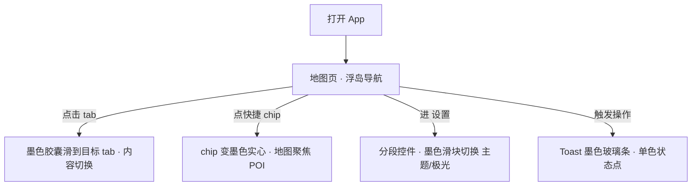

# Design — 文轩校园地图 · 交互胶囊重设计（OpenAI 风格）

> 本文件是产品设计单一事实来源（source of truth）。各阶段产出直接追加到对应小节。
> 标注 `> 假设：…` 的内容未经确认，发现不对请直接修改或告知。

## Brief（产品简报）

- **定位**：四川文轩职业学院遂宁校区校园导览 PWA（v3.28 凝光流体版），本轮聚焦**交互胶囊组件的视觉重设计**。
- **目标用户**：在校学生 / 新生 / 访客（移动端为主）。
- **核心任务（JTBD）**：快速找地点、看导览、用失物招领/聊天；交互控件要"干净、不打扰、像系统原生"。
- **本轮问题**：底部导航浮岛 / 快捷 chips / 分段按钮 / Toast 等"交互胶囊"目前是暖橙色 + 光晕风格，用户反馈**颜色太丑**，希望对齐 **OpenAI/ChatGPT 的设计语言**（中性、克制、墨色为主、单一强调色、极简反馈）。
- **非目标（不做）**：不改信息架构与交互逻辑；不动地图底图与 POI 配色；液态玻璃材质保留（只调"胶囊着装"）；品牌橙色保留在 logo 与主 CTA，不再用于胶囊状态。
- **成功指标**：胶囊视觉对齐 ChatGPT 应用观感；对比度全部达标（WCAG AA）；暗色/亮色主题一致性好；不引入新的逐帧重绘。

> 假设：用户说的"交互胶囊"指底部浮岛导航、快捷 chips、分段控件（主题/极光）、Toast 这几类胶囊形控件；"OpenAI 一样"指 ChatGPT 移动端的中性极简语言（墨色激活态 + 灰阶表面 + 单强调色）。不对请纠正。

## Concepts（产品概念）

### 概念 A — 暖橙精修
- 一句话：保留橙色品牌调，仅降低饱和度与光晕强度。
- 差异点：改动最小，品牌延续性最强。
- 主要风险：本质还是"彩色光晕"，大概率仍被认为丑；不满足"像 OpenAI"。

### 概念 B — 墨石 Monolith（推荐）
- 一句话：玻璃材质不变，胶囊状态全面中性化——**激活态=墨色实心胶囊**（亮色：#111 白字 / 暗色：#F2F2F2 黑字），表面走 ChatGPT 灰阶（#F7F7F8/#ECECF1、暗色 #1B1B1F/#2F2F2F），橙色只留在 logo 与主 CTA。
- 差异点：最接近 ChatGPT 观感；状态对比靠明度而非色相，暗亮主题天然一致；对比度容易达标。
- 主要风险：与地图 POI 的多彩分类色并存时，需要控制胶囊中性度才不冲突。

### 概念 C — 纯白极简
- 一句话：胶囊去玻璃化，纯白/纯黑平面 + 细边框。
- 差异点：最激进、最"系统原生"。
- 主要风险：丢掉全站的液态玻璃身份，与应用其他部分割裂。

**推荐**：B，理由：材质身份保留、状态语言换成 ChatGPT 式墨色明度对比，观感对齐度最高且实现风险低。

## Design Tokens（墨石方向）

| Token | 亮色 | 暗色 | 用途 |
|---|---|---|---|
| `--cap-ink` | #111114 | #F2F2F3 | 激活胶囊底色 |
| `--cap-ink-text` | #FFFFFF | #0D0D0F | 激活胶囊文字/图标 |
| `--cap-surface` | rgba(255,255,255,.66) | rgba(27,27,31,.78) | 胶囊默认表面（玻璃） |
| `--cap-surface-active` | #111114 | #F2F2F3 | 激活表面 |
| `--cap-track` | #ECECF1 | #2F2F2F | 分段控件轨道 |
| `--cap-thumb` | #FFFFFF | #3A3A40 | 分段控件滑块 |
| `--cap-hairline` | rgba(0,0,0,.08) | rgba(255,255,255,.10) | 描边 |
| `--cap-wash` | rgba(0,0,0,.06) | rgba(255,255,255,.08) | 按压水洗层（替代橙色涟漪） |
| 品牌橙 `#F0782E` | 仅 logo 图标、主 CTA（登录/注册）、地图 POI 强调 | 同左 | 不再进入胶囊状态 |

## Flows（用户流程）

## Prototypes（原型）

- [x] `prototypes/capsule-openai-style.html` — 交互胶囊新旧对照 + 可交互状态（亮/暗切换、tab/chip/分段/Toast），状态：已评审

## Critique（评审笔记）

| 优先级 | 问题 | 位置 | 建议 |
|---|---|---|---|
| P1 | 墨色激活 tab 与暗色主题表面明度接近，暗色下激活态对比减弱 | 浮岛导航 | 暗色激活胶囊改用 #F2F2F3 浅墨反白，已采纳 |
| P1 | Toast 从彩色光晕改为中性后，成功/失败语义弱化 | Toast | 保留 6px 单色状态点（绿/红/橙），面积小不破坏中性 |
| P2 | 品牌橙仅剩 logo/CTA，地图页内 FAB 等仍带橙色 hover | 过渡层 | 本轮一并中性化 FAB/chips hover，POI 分类色不动 |
| P2 | 分段控件从"文字变色"改为"滑块移动"后，无动效会显得生硬 | 分段控件 | 滑块用 spring 位移动画（transform，合成器） |
| P3 | 涟漪改中性水洗层后，触觉反馈略弱 | 全局胶囊 | 保留 0.09s 按压缩放补偿 |

## Decisions（决策记录）

- 2026-09-19 — 采纳概念 B「墨石 Monolith」—— 用户点名 OpenAI 风；明度对比方案在亮暗主题下都达标。
- 2026-09-19 — 液态玻璃材质保留，只中性化胶囊的着色与状态 — 保住全站设计身份，改动聚焦。
- 2026-09-19 — 品牌橙退出胶囊状态，仅存 logo/主 CTA — ChatGPT 语言=单强调色克制使用。
- 2026-09-19 — **v3.29 已实施并上线**（SW v74）。实施要点：纯 CSS 追加覆盖；发现原暗色主题两条规则（`[data-theme="dark"] #tabbar` 底色、`.tab.active` 橙字）以更高优先级压制新 token，已用同等选择器在后段覆盖；emoji 图标保留原生彩色（原型评审 P3 已知项）。Canva 方向稿：<https://www.canva.com/d/_Bs3gQTvyqQE6AO>

- 2026-09-19 — **v3.30 内页墨石化**：应「其他地方没有优化」反馈，按保留清单系统性清扫 262 处暖色（logo/启动屏/欢迎页/POI 层/导航路线语义/btn-primary 保留品牌橙）；主 CTA（发布/认领/搜索/账户）一并转墨色实心（OpenAI 黑按钮语言）；暗色主题下墨色填充组件文字反转。SW v75。

- 2026-09-19 — **v3.31 设置去折叠 + 图标系统重做**：应「折叠影响美观」反馈，移除设置页五组折叠交互（HTML 结构级：toggle/arrow/collapsed 全部删除，JS 绑定自然失效）；分组标题改为 ChatGPT 式小节头（中性小字 + iconsax 图标）；个人中心入口行与区块标题的 emoji 图标全部换成 iconsax Web Component（setting-2 / danger / broom / message-question / location / star / clock / brush / shield-tick / setting-4 / info-circle / shield-security / book）；行分隔改 hairline。SW v76。

- 2026-09-19 — **v3.32 参考图重排**：用户提供豆包式设置页参考图。要点：①页面底改纯平中性灰（去极光渐变）；②卡片改纯白实底（去玻璃 blur，hairline 描边 + 极浅阴影）；③分组标题外置到卡片外（小节头 = 中性小字，卡片只含内容行）；④图标放大（入口 22px / 标题 17px / 分组 20px）且改墨色描边风；⑤行距加宽、入口行去 hairline、页面标题居中。SW v77。

- 2026-09-19 — **v3.33 设置页图标收尾**：隐私与权限 shield-security、清除全部本地数据 trash、地图反馈 message-question、用户协议 document-text、隐私政策 padlock、作者 profile-circle、更新计划 map-1，全部换 iconsax linear；设置页 emoji 清零。SW v78。

- 2026-09-19 — **v3.33 缓存根因修复**：index.html 的 script/link 资源版本参数不统一（8 个脚本停在 ?v=86，i18n/appshell/app 分别 88/89/90，css 91），配合静态资源 5 分钟强缓存，导致发版后部分客户端长时间运行旧 JS（检查更新文案一直显示 v3.24 即此因）。统一全部 ?v=92。今后发版需同步递增该参数与 sw.js CACHE 名。

- 2026-09-19 — **v3.33 修复「15栋不能编辑位置」**：根因①worker 地图高度校验 MAP_H=500 与客户端 MAP_HEIGHT=583 不一致，y>500（宿舍区）的位置编辑一律 400；根因②b_dorm15 挂着 9/18 的错误改名 override（学生宿舍15#→"学生宿舍18"）。修复：MAP_H→583 并部署 worker；D1 json_set 恢复名称（保留他人修正的位置 477.2/395.7）；本地 db.json 同步。遗留：自定义重复点 b_user_1788178486131「学生宿舍15栋#」(358.7/402.9) 待用户决定是否删除。

- 2026-09-19 — **v3.34 位置自定义编辑开放到全部地点**：根因是信息卡的管理操作块（编辑/删除/备注）包在 `${isCustom ? …}` 里，官方地点（如 学生宿舍15#）完全没有编辑入口。改为无条件渲染：所有地点均可改名/分类/简介/移点/删除（官方=软删可恢复）/恢复默认。云端同步仍需登录（未登录编辑仅本地、刷新丢失——云端为唯一事实源）。SW v79；资源版本 ?v=93。**按用户要求暂不更新线上**。
- 2026-09-19 — **v3.33 补充**：本地 server.js 也有独立校验器，MAP_H 500 → 583 同步修复；端到端验证 PUT y=550 成功（修复前 400）。

- 2026-09-19 — **v3.35 失物招领交互修复**：根因①懒加载竞态——首次切「招领」tab 才注入 lostfound.js，弱网/缓存抖动下加载失败且无重试，页面渲染但零事件处理器（"能看不能点"）。改为启动时空闲时段预载 lostfound/chat 模块；根因②v3.32 头部居中改造后，招领页头部含第三个子元素（发布按钮），标题被返回钮压住——改为标题绝对居中。SW v80，资源 ?v=94。

- 2026-09-19 — **v3.35 根因链条完整确认**：①appshell switchTab 的 lostfound/chat 分支只调 load()/renderRooms()，从未调用模块的 init()——bind() 从未执行，页面"能看不能点"（自上线起即如此）；②懒加载脚本 URL 硬编码 ?v=86，与资源版本体系脱节，发版后旧模块可被 HTTP 缓存长期残留；③SW controllerchange 自动 location.reload() 会在用户交互中途打断（SW 更新触发）。修复：switchTab 与启动预载均按需调用 init()（_inited 幂等标记），懒加载版本自动跟随主资源版本。已部署 SW v80。

- 2026-09-19 — **v3.37 按邮箱搜索添加好友**：worker `/api/chat/users` 支持 `q` 参数（邮箱/昵称模糊匹配）；添加好友抽屉新增搜索框（搜索框输入即过滤，结果行显示邮箱）；好友请求流沿用既有 friends 表体系（request → 对方同意 → 互为好友，资料卡为统一入口）。本地 server.js 镜像了 users/friends 全部路由（此前本地缺失导致"加载好友失败"）。端到端验证：搜索→请求→同意→互为好友 全通。SW v82，资源 ?v=98。

- 2026-09-19 — **v3.38 D1 数据库迁移至新加坡**（注：旧库 wenxuan-campus-map-db 已于同日【已删除】，归档 backups/legacy-db-wnam-archive.sql）：原库 wenxuan-campus-map-db 主区域在北美（WNAM/SJC），国内访问延迟高。流程：本地地图数据（overrides/deleted/custom，含用户删除官方 15#、自建 15栋#/18# 等全部编辑）先同步至原库 → d1 export 全量导出（10 表）→ 新建 wenxuan-campus-map-db-sg（--location=apac，主区域新加坡 SIN）→ 导入 → wrangler.jsonc 切换绑定 → 部署 worker。数据完整性验证：users 8 / lf_posts 0 / messages 16 / friends 3 / customs 53。旧库保留作为回滚备份（回滚方式：wrangler.jsonc 指回旧 id 并重新部署）。
- 2026-09-19 — **新加坡迁移验证通过**：①数据完整：users 8 / friends 3 / messages 16 / customs 53；②写入链路：新注册账号（白名单真实值）201 成功、登录 200、读 users 表正常（验证后清除测试账号恢复 8 个真实用户）；③线上站点浏览器端确认：90 个地点渲染、地图底图、API ready；④未登录编辑仍正确返回 401（安全策略完好）。

- 2026-09-19 — **v3.38 数据终版（59 点）**：用户在校验地图梳理后定稿——40 个官方点保留 6 个（学院大门/车辆出入口/1号教学楼/音乐喷泉/第一足球场/第二足球场），删除 34 个（均为过时或重复，代之以更准的自建点）；自建点 53 个（含 15栋#/18# 等宿舍、餐厅、教学楼全量）。本地 db.json 与线上新加坡库（APAC/SIN）经 SQL 同步完全一致；线上浏览器验证 59 个标记全部渲染可见。
- 2026-09-19 — **旧库清理**：应「删除旧位置数据避免弄混」——旧北美库已删除（归档 backups/legacy-db-wnam-archive.sql，纯冷备份）；全项目扫描并修复旧库名残留：deploy-cloudflare.sh 的 D1_NAME、docs/deploy-cloudflare.md、wrangler.jsonc 示例命令均已更新为 -sg；D1 列表现仅剩新加坡库。campus-data.js / seed.json 中的 40 个官方点定义保留（「恢复默认」功能依赖，被删的 34 个点不显示不参与）。
- 2026-09-19 — **代码上传 GitHub**：私有仓库 https://github.com/fyjf743/wenxuan-campus-map（master 分支，62 文件）。要点：①隐私净化——含真实用户数据的旧库归档 SQL 排除（.gitignore），db.json 去账号/JWT 密钥后入库（地图 59 点数据保留，本地运行时版含测试账号未入库）；②环境——本机原本无 git，已装 Git 2.55 + GitHub CLI 2.101；③网络——GitHub 主站直连不稳，gh/git 已配置走本机代理 127.0.0.1:7897（git 为仓库级 local 配置）；④授权——gh 设备码流程，账号 fyjf743。
