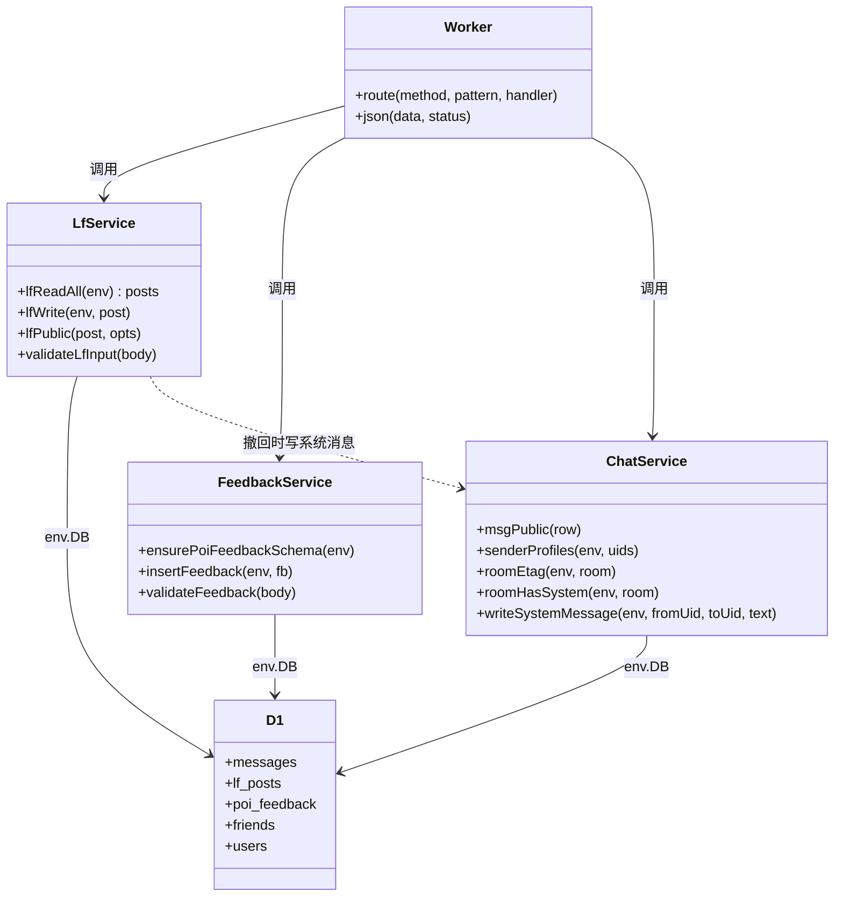
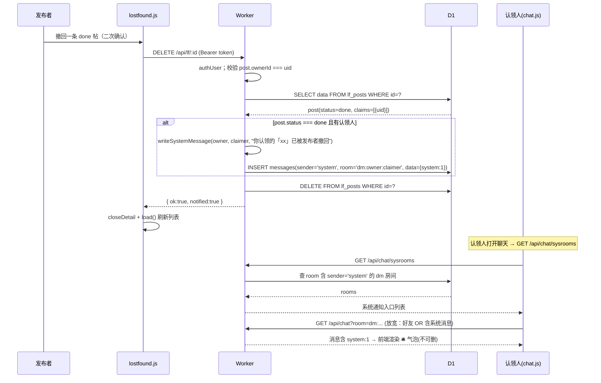

# v3.21 架构设计 · 失物招领闭环 + 体验优化

> 架构师：高见远（Gao）
> 版本基线：v3.20（Cloudflare Pages + Worker + D1）
> 上游输入：`docs/PRD-v3.21.md`
> 交付物：本架构文档 + `docs/sequence-diagram.mermaid` + `docs/class-diagram.mermaid`

---

## 0. 现状勘误（重要：本版部分需求已有"旧语义"半成品，需按 PRD 校正）

开工前先对齐现状，避免在错误语义上叠加：

| 需求 | 现状 | 结论 |
|------|------|------|
| P0-1 完成认领 | 已存在 `POST /api/lf/:id/finish`，但它是**物理删除帖子**（`DELETE FROM lf_posts`）；前端 `finishPost` 用 `window.confirm`，按钮文案"📦 立即归档（跳过等待）" | **语义不符**，需重写为"确认完成（状态保持 `done`，写入 `confirmedAt`，清除倒计时）" |
| P0-2 我的二级 tab | 目前"我的"是平铺列表，仅靠 `visiblePosts` 里 `rank` 排序 | **未实现**，需新增 sub-tab |
| P0-5 热门 chips | 无 | **未实现** |
| P1-3 撤回通知 | 聊天无系统消息机制 | **未实现**，需 worker 加 `system` 标记 + 前端特殊样式 |
| P1-6 分享 | 详情卡 `#shareBtn` 已实现 `navigator.share` + 剪贴板降级 + 生成 `?poi=`；`?poi=` **冷启动解析已实现**（app.js boot 第 2072-2084 行） | **仅缺**"同窗口二次导航（PWA 已打开再点链接）"解析路径 |
| P1-7 报错落库 | 无 `poi_feedback` 表、无接口、无 UI | **未实现** |
| P2-4 done 卡片降级 | CSS 已有 `.lf-card.lf-done`（grayscale 85% + opacity 0.5 + "✅ 已完成"角标） | **基本实现**，需对齐 PRD 数值（opacity 0.55）并补暗色独立调参 |

> 说明：仓库里散落的 `v3.21: P0-3 / P1-5` 注释是早期草稿编号，与 PRD 正式编号（P0-1/P0-2/P0-5/P1-3/P1-6/P1-7/P2-4）不一致。**以 PRD 编号为准**。

---

## 1. 实现方案

### 1.1 总体思路

**后端（Worker + D1）**：复用既有原生 fetch 路由 + `route('METHOD', '/api/...')` 注册模式，不引新框架。核心改动集中在失物招领闭环语义修正（`finish` 由"物理删除"改为"确认完成"）、新增一张独立行级表 `poi_feedback`（多字段独立列）、以及把聊天系统消息当作一种"服务端生成的私信"写入现有 `messages` 表（`sender='system'` + `data` 里打 `system:1` 标记），并放宽私聊读取门槛让非好友认领人也能收到撤回通知。

**前端（静态 PWA）**：全部沿用现有 `window.*` 全局模块 + 液态玻璃设计语言，不引新框架。地图侧在 `app.js` 增加 chips 渲染与深链补全；失物招领侧在 `lostfound.js` 修正完成认领交互并新增"我的"二级 tab；详情卡新增"报错"入口（复用 `.lf-sheet` bottom-sheet 模式）；聊天侧在 `chat.js` 识别系统消息并渲染 🛎️ 气泡 + 系统通知入口。样式统一追加到 `css/style.css` 单一样式表，文案统一追加到 `js/i18n.js` 扁平字典（10 语种）。

### 1.2 每项需求实现要点

- **P0-1 主动"完成认领"**
  - 认领成功即 `done`（现有逻辑），但**不再写 `autoDeleteAt`**；`lfReadAll` 移除"已认领超 5 分钟自动删除"分支。
  - 新增/复用 `POST /api/lf/:id/finish`：仅发布者或认领人可调，仅 `done` 可调；写 `confirmedAt = Date.now()`，`autoDeleteAt = null`，**不删帖**，返回投影后的 post。
  - 前端 done 详情：未确认→主按钮"✅ 完成认领"（loading 态"确认中…"）；已确认→文案收敛为"✅ 已由你确认完成"，隐藏倒计时文案。
- **P0-2 "我的"二级 tab**
  - "我的" tab 内容区顶部加两个开关式 sub-tab：进行中(`open`) / 已完成(`done`)，各显计数，默认落"进行中"。
  - 仅过滤 `ownerId === 当前用户`，按 status 二分；`pending` 已废弃（决策 B）。
- **P0-5 热门地点快捷 chips**
  - 地图视图底部、tab 栏上方加一条横向可滚动液态玻璃 chips（🍴 食堂 / 📦 快递站 / ⚽ 运动场 / ⛑ 医务室）。
  - 映射固定 4 个 POI：`b_canteen1` / `b_express` / `b_field1` / `b_medical`（均已确认存在于 `campus-data.js` 与 `data/seed.json`）。
  - 点击：若详情已开先关，再 `flyToBuilding(id)` + `showBuildingInfo(id)`。
- **P1-3 撤回已完成帖通知认领人**
  - `DELETE /api/lf/:id`：删除前若 `status==='done'` 且存在 `claims[0]`，向认领人写一条系统私信"你认领的「{title}」已被发布者撤回"；`open` 撤回不发。
  - 系统消息复用 `messages` 表：`sender='system'`、`data={text, senderName:'系统通知', system:1}`、房间 `dm:<owner>:<claimer>`（无需好友关系）。
  - `GET /api/chat` 私聊读取门槛放宽为：参与者且（互为好友 **或** 房间含系统消息）。
  - 新增 `GET /api/chat/sysrooms` 让非好友认领人能在会话列表看到该系统通知入口。
- **P1-6 分享**
  - 分享按钮已实现；仅补"已打开页面收到同窗口分享链接"路径：把深链解析抽成 `handleDeepLink()`，在 `DOMContentLoaded` 与 `pageshow` 双入口调用。
- **P1-7 报错落库**
  - 详情卡底部加"📝 数据报错"小字链接 → bottom-sheet 表单（4 选 1 单选 + ≤100 字备注 + 计数）→ `POST /api/pois/:id/feedback` 落库 → toast。
  - 无需登录即可提交（决策 E）；已登录则记录 `user_id`，匿名置 `NULL`。
- **P2-4 done 卡片降级**
  - 对齐 PRD 数值（opacity 0.55），补暗色模式独立 filter/角标配色（现有只写了浅色一套）。

---

## 2. 框架选型

**不引入任何新框架/新库**，完全复用现有技术栈：

| 层 | 现有选型 | 本次是否变更 |
|----|---------|-------------|
| 前端 | 原生 ES + Leaflet 1.9.4（CDN）+ 单页 PWA + Service Worker | 不变 |
| 样式 | `css/style.css` 单一样式表 + 液态玻璃变量（`--glass-*`） | 不变 |
| 多语言 | `js/i18n.js` 扁平字典（10 语种，`I18N.t()` / `I18N.poi()`） | 不变 |
| 后端 | Cloudflare Worker 原生 `fetch` handler + `route()` 注册表 + D1（`env.DB.prepare().bind().all()/.first()/.run()`） | 不变 |
| 鉴权 | PBKDF2 + HMAC token（`authUser` / `verifyToken`） | 不变 |
| 部署 | `wrangler` + `scripts/deploy-cloudflare.sh` + `scripts/build-pages.mjs` | 不变 |

**新增 npm 包：无。**

---

## 3. 文件清单

| 路径 | 动作 | 用途 |
|------|------|------|
| `worker/schema.sql` | 修改 | 追加 `poi_feedback` 建表语句（含索引） |
| `worker/src/index.js` | 修改 | `finish` 语义重写 + `claim` 移除 autoDelete + `lfReadAll`/`lfPublic` 增 `confirmedAt`；撤回写系统消息；`msgPublic` 透传 `system`；`GET /api/chat` 放宽 dm 门槛；新增 `GET /api/chat/sysrooms`、`POST /api/pois/:id/feedback`；`ensurePoiFeedbackSchema` |
| `js/lostfound.js` | 修改 | 完成认领按钮/确认态；"我的"二级 tab；撤回文案；`finishPost` 改为确认完成 |
| `js/chat.js` | 修改 | 系统消息气泡渲染（🛎️ + 不可删）；`loadFriendList` 加载并渲染系统通知入口；`openRoom` 支持系统房间跳过好友校验 |
| `js/app.js` | 修改 | 热门 chips 渲染与点击；深链 `handleDeepLink()` 双入口；详情卡"报错"入口与表单提交 |
| `js/i18n.js` | 修改 | 新增 `quick.*`、`lf.finish*`、`lf.mine.*`、`poi.feedback.*`、`chat.sys.*` 等 key（10 语种）；修正 `lf.claim.hint`/`lf.auto.delete.hint` 旧文案 |
| `index.html` | 修改 | 新增 chips 容器 `#quickChips`；新增报错 bottom-sheet `#poiFeedbackSheet`；"我的"二级 tab 容器；`?v=` 版本号 bump |
| `css/style.css` | 修改 | chips 玻璃胶囊样式；二级 tab 样式；报错表单样式；系统消息气泡样式；`.lf-card.lf-done` 数值对齐 + 暗色 |
| `sw.js` | 修改 | `CACHE` 版本号 bump（v63 → v64） |
| `js/appshell.js` | 修改 | `_ensureLoaded` 懒加载路径 `?v=` bump；`updateDesc`/版本文案 v3.14 → v3.21 |
| `docs/ARCH-v3.21.md` | 新增 | 本文档 |
| `docs/sequence-diagram.mermaid` | 新增 | 时序图 |
| `docs/class-diagram.mermaid` | 新增 | 类图 |

> 无需改动：`routing.js`、`campus-data.js`、`college-data.js`、`auth.js`、`permissions.js`、`api.js`、`wrangler.toml/jsonc`、`data/seed.json`、`scripts/*`（除部署时版本号由脚本读 `sw.js`/`index.html`）。

---

## 4. 数据结构 / 接口

### 4.1 `poi_feedback` D1 表（新增，追加到 `worker/schema.sql`）

```sql
-- 地点报错反馈（v3.21）：一行一条反馈，多字段独立列
CREATE TABLE IF NOT EXISTS poi_feedback (
    id         TEXT PRIMARY KEY,              -- 'fb_' + randomHex
    poi_id     TEXT NOT NULL,                 -- 对应地点 id
    type       TEXT NOT NULL,                 -- closed / coords / info / other
    text       TEXT NOT NULL,                 -- 备注，<=100 字
    user_id    TEXT,                          -- 提交者 uid，匿名可为 NULL
    created_at INTEGER NOT NULL,
    status     TEXT NOT NULL DEFAULT 'new'    -- new / resolved
);
CREATE INDEX IF NOT EXISTS idx_pfb_poi ON poi_feedback(poi_id, created_at DESC);
```

> 运行时幂等建表（仿 `ensureFriendsSchema`）：新增 `ensurePoiFeedbackSchema(env)`，首次调用执行 `CREATE TABLE IF NOT EXISTS ...` + 索引。

### 4.2 聊天系统消息（不建新表，不打列迁移）

复用 `messages` 表，用 `sender` + `data` 表达系统消息（**避免对生产表做 ALTER**）：

```js
// 系统消息行
{ id: 'm_' + randomHex(8), room: 'dm:<owner>:<claimer>', sender: 'system',
  data: JSON.stringify({ text: '你认领的「xx」已被发布者撤回', senderName: '系统通知', system: 1 }),
  created_at: Date.now() }
```

- `msgPublic(row)` 增加投影：`system: !!(d.system)`。
- 判房间是否含系统消息：`roomHasSystem(env, room)` → `SELECT 1 FROM messages WHERE room=? AND sender='system' LIMIT 1`。

### 4.3 `lf_posts` 数据结构（data JSON 内新增字段）

```js
{
  // ... 既有字段不变 ...
  autoDeleteAt: null,          // 保留字段但不再赋值（决策 A：取消 5 分钟兜底清理）
  confirmedAt: null,           // 新增：人工确认完成时间戳；认领时 null，完成认领后 = Date.now()
}
```

- `lfPublic` 投影增加 `confirmedAt`。
- `lfReadAll` 删除 `p.status==='done' && p.autoDeleteAt && p.autoDeleteAt < now` 的物理删除分支。
- `claim` 成功路径删除 `post.autoDeleteAt = Date.now() + LF_AUTO_DELETE;`。

### 4.4 API 端点（新增/修改）

| METHOD | 路径 | 权限 | 入参 | 出参 | 变更 |
|--------|------|------|------|------|------|
| POST | `/api/pois/:id/feedback` | 公开（可选登录） | `{ type, text }`；type ∈ closed/coords/info/other；text 1~100 字 | `{ ok:true, id }` 201；400/404 | 新增 |
| POST | `/api/lf/:id/finish` | 登录；发布者或认领人 | — | `{ ok:true, post }`；403/404/409 | 重写语义 |
| POST | `/api/lf/:id/claim` | 登录 | `{ answer }` | `{ ok:true, message }` | 移除 autoDelete 与 5 分钟文案 |
| DELETE | `/api/lf/:id` | 登录；仅作者 | — | `{ ok:true, notified:boolean }` | 撤回 done 帖时写系统消息 |
| GET | `/api/chat` | 登录 | `?room=dm:a:b&...` | 消息含 `system` 字段 | 放宽 dm 读取门槛 |
| GET | `/api/chat/sysrooms` | 登录 | — | `{ rooms:[{room, peer:{id,nickname,avatar}, lastText, createdAt}] }` | 新增 |

校验规则（feedback）：`type` 必须在白名单；`text` 去除首尾空白后 1~100 字；`poi_id` 必须存在于 `listPois(db, {includeDeleted:true})`。

### 4.5 类图



---

## 5. 时序图

### 5.1 完成认领流程（P0-1）

```mermaid
sequenceDiagram
    participant U as 用户(认领人/发布者)
    participant FE as lostfound.js
    participant API as Worker
    participant DB as D1(lf_posts)

    U->>FE: 点击「✅ 完成认领」
    FE->>FE: 按钮 loading「确认中…」
    FE->>API: POST /api/lf/:id/finish (Bearer token)
    API->>API: authUser 校验身份
    API->>DB: SELECT data FROM lf_posts WHERE id=?
    DB-->>API: post(JSON)
    alt 非发布者且非认领人
        API-->>FE: 403 只有发布者或认领人可以归档此帖
        FE-->>U: toast 报错，按钮恢复
    else 状态非 done
        API-->>FE: 409 帖子尚未认领完成
    else 合法
        API->>API: post.confirmedAt = Date.now(); post.autoDeleteAt = null
        API->>DB: UPSERT lf_posts (写回 data)
        DB-->>API: ok
        API-->>FE: { ok:true, post:{ confirmedAt } }
        FE->>FE: 更新本地 posts + 重渲染详情
        FE-->>U: 「✅ 已由你确认完成」，隐藏倒计时
    end
```

### 5.2 撤回通知流程（P1-3）



---

## 6. 任务列表（关键输出）

> 按 P0 → P1 → P2 排序；同优先级内部按"后端 → 前端 → 样式/收尾"排序。工作量：S(≤半天) / M(半天~1天) / L(>1天)。

- [ ] **T1 [M] 后端 · 失物招领"完成认领"闭环语义修正**
  - 文件：`worker/src/index.js`
  - 依赖：无
  - 说明：重写 `POST /api/lf/:id/finish`（不删帖，写 `confirmedAt`、清 `autoDeleteAt`）；`claim` 移除 `autoDeleteAt` 赋值与 5 分钟文案；`lfReadAll` 删除自动清理分支；`lfPublic` 透传 `confirmedAt`。

- [ ] **T2 [M] 前端 · 完成认领按钮 + "我的"二级 tab**
  - 文件：`js/lostfound.js` / `index.html` / `css/style.css` / `js/i18n.js`
  - 依赖：T1
  - 说明：done 详情区分"未确认(✅完成认领按钮+loading) / 已确认(✅已由你确认完成)"；重写 `finishPost` 去掉原生 confirm；"我的"加 进行中/已完成 两个 sub-tab（计数+默认进行中）；更新旧"5分钟自动删除"文案。

- [ ] **T3 [S] 前端 · 热门地点快捷 chips**
  - 文件：`js/app.js` / `index.html` / `css/style.css` / `js/i18n.js`
  - 依赖：无（仅依赖既有 `flyToBuilding`/`showBuildingInfo`）
  - 说明：地图底部渲染 4 个玻璃胶囊 chips（食堂/快递站/运动场/医务室，映射 `b_canteen1`/`b_express`/`b_field1`/`b_medical`），点击关闭详情后 flyTo + 打开详情；横向可滚动，随 tab 显隐。

- [ ] **T4 [M] 后端 · 报错落库 + 撤回系统通知**
  - 文件：`worker/schema.sql` / `worker/src/index.js`
  - 依赖：T1
  - 说明：新增 `poi_feedback` 表与 `POST /api/pois/:id/feedback`（公开，type 白名单+100 字校验）；新增 `writeSystemMessage`/`roomHasSystem`；`DELETE /api/lf/:id` 撤回 done 帖时写系统消息；`msgPublic` 透传 `system`；`GET /api/chat` 放宽 dm 读取门槛；新增 `GET /api/chat/sysrooms`。

- [ ] **T5 [M] 前端 · 详情"报错"表单 + 分享深链补全**
  - 文件：`js/app.js` / `index.html` / `css/style.css` / `js/i18n.js`
  - 依赖：T4（feedback 接口）
  - 说明：详情卡底部"📝 数据报错"入口 + bottom-sheet 表单（4 选 1 + ≤100 字计数 + 提交 toast）；把 `?poi=` 深链解析抽为 `handleDeepLink()`，在 `DOMContentLoaded` 与 `pageshow` 双入口调用以覆盖 PWA 同窗口二次导航。

- [ ] **T6 [M] 前端 · 聊天系统消息渲染 + 系统通知入口**
  - 文件：`js/chat.js` / `css/style.css` / `js/i18n.js`
  - 依赖：T4（sysrooms / system 字段）
  - 说明：`_msgNodeHtml`/`_appendMsg` 识别 `m.system` 渲染 🛎️ 系统气泡（无头像/无删除操作）；`loadFriendList` 拉 `api/chat/sysrooms` 并在 dmList 顶部渲染"系统通知"区；`openRoom` 支持系统房间跳过好友校验。

- [ ] **T7 [S] 样式/收尾 · done 卡片降级完善 + 版本号与文案收尾**
  - 文件：`css/style.css` / `sw.js` / `index.html` / `js/appshell.js`
  - 依赖：T2/T3/T5/T6（样式类名最终确定后统一收口）
  - 说明：`.lf-card.lf-done` 对齐 opacity 0.55 + 暗色独立 filter/角标配色；`sw.js` `CACHE` v63→v64，`index.html` `?v=85`→`?v=86`，`appshell.js` `_ensureLoaded` 懒加载路径 `?v=` 同步 bump；`updateDesc`/设置页版本文案 v3.14→v3.21；跑一遍部署脚本自检。

---

## 7. 依赖包

**无。** 本次不新增任何 npm/第三方依赖，全部复用现有 Worker/前端栈。

---

## 8. 共享知识（跨文件约定）

- **API 统一返回**：成功 `{ ...data }`；失败 `{ error, code? }` + 对应 HTTP 状态；`code` 用于前端分支（如 `AUTH_REQUIRED`/`FRIEND_REQUIRED`/`CONTENT_BLOCKED`）。
- **鉴权**：前端 `CampusAPI._fetch` 自动附带 `Authorization: Bearer <token>`；Worker 用 `authUser(env, req)` 解析，未登录公开接口返回 401 + `code:'AUTH_REQUIRED'`。
- **D1 行级存储**：独立高频写用行级表（`lf_posts`/`poi_feedback`），JSON 大字段用 `data TEXT`；`poi_feedback` 用多字段独立列。写入一律 UPSERT（`ON CONFLICT(...) DO UPDATE`）。
- **表名**：聊天表实际名称为 **`messages`**（非 PRD 背景里提到的 `chat_messages`，以代码为准）。系统消息靠 `sender='system'` + `data.system=1` 表达，**不新增列、不 ALTER**。
- **字段命名**：时间戳统一 `created_at`/`resolvedAt`/`confirmedAt`/`autoDeleteAt`（毫秒）；id 前缀：用户 `u_`、帖 `lf_`、反馈 `fb_`、消息 `m_`、地点 `b_`。
- **LF 状态机**：`open`(进行中) / `done`(已完成)；`pending` 已废弃。`confirmedAt==null` 的 `done` = 刚认领未确认，`confirmedAt` 有值 = 已人工确认完成。
- **系统消息规则**（决策 C）：普通气泡样式 + 头部 🛎️ 提示"来自系统"，前端不渲染删除操作，后端写系统消息不经好友校验、且不参与内容安全扫描。
- **私聊读取门槛**：`dm:` 房间参与者可读需 `areFriends` **或** `roomHasSystem`；写用户消息仍严格 `areFriends`，系统消息写放行。
- **i18n**：`js/i18n.js` 扁平字典，key 形如 `域.子项`（`lf.finish`、`quick.canteen`、`poi.feedback.type.closed`、`chat.sys.title`）；**每个 key 必须补 10 语种**（zh/en/tw/ja/ko/th/vi/ms/id/fil），缺失时 `I18N.t` 回退 zh。地点名/描述走 `I18N.poi(id)`/`I18N.poiDesc(id)`。
- **CSS**：全部追加 `css/style.css`；液态玻璃用 `--glass-*` 变量；暗色用 `[data-theme="dark"]` 覆盖；组件前缀复用 `lf-`（失物招领）/`chat-`（聊天）/`info-`（详情卡），本次新前缀 `quick-`（chips）、`poi-fb-`（报错）。
- **缓存/版本**：PWA 静态资源"网络优先，失败回退缓存"；发版必须同步 bump `sw.js` 的 `CACHE`（v63→v64）与 `index.html` 尾部 `?v=`（85→86）以及 `appshell.js` `_ensureLoaded` 里懒加载路径的 `?v=`；`sw.js` 的 `CORE` 已含 `lostfound.js`/`chat.js`，本次不新增 JS 文件，无需增补缓存清单。
- **坐标约定**：数据 `(x, y)`，`y` 向下为正；转 Leaflet 用 `MAP.toLatLng(x,y) = [MAP_HEIGHT - y, x]`。chips 复用 `flyToBuilding` 无需自行换算。

---

## 9. 待明确事项

1. **P0-1 数据二选一（决策 A）**：已假设采用 **① 新增 `confirmedAt`**（可区分"仅认领完成"与"已人工确认完成"，契合 P0-2/P2-4）。若团队追求最小 diff，可改用 ② 直接清空 `autoDeleteAt` —— 需在 T1/T2 同步调整判断逻辑。
2. **系统通知"已读"状态**：已假设本期不引入 per-room 已读水位，系统通知入口常显、点开即算处理；底部 Tab 角标暂不叠加系统通知未读数。后续可加。
3. **撤回通知的非好友可读性**：已假设放宽 dm 读取门槛（好友 OR 房间含系统消息）并新增 `sysrooms` 入口；若产品希望"非好友也能在会话列表直接看到"，此方案即满足；若产品坚持"通知必须走独立通知中心"，需另开一期。
4. **chips 具体 POI（决策 E）**：已按 PRD 落 `b_canteen1`/`b_express`/`b_field1`/`b_medical`；其中"运动场"取**第一足球场** `b_field1`（KEY_POIS 已收录、导览生活动线也指向它）。如需换成"第二足球场"或"篮球主场"请在开工前告知。
5. **报错无需登录（决策 E）**：已假设匿名可提交，`user_id` 置 `NULL`；已登录则记录 uid，便于后续"管理员回复/私信"扩展。
6. **分享域名**：已假设前端用 `location.origin + location.pathname + '?poi=' + id` 动态生成（现状已实现），不硬编码 `*.pages.dev`，兼容任意部署域名。
7. **版本号收口**：当前 `sw.js` 是 `CACHE='wenxuan-map-v63'`（并非背景里提到的 `SW_VERSION` 常量，代码里无该常量）；发版 bump 点共 3 处（sw.js CACHE、index.html `?v=`、appshell.js 懒加载 `?v=`）。已假设统一升到 v64 / v86。
8. **`MAP_HEIGHT` 前后端不一致**：前端 `campus-data.js` 为 583，后端 `worker/src/index.js` 为 500。本次反馈/chips 不涉及坐标校验，**不改动**；仅备注为既有技术债，未来若做"坐标报错自动纠偏"需统一。

---

## 附：Mermaid 导出

- 时序图：`docs/sequence-diagram.mermaid`
- 类图：`docs/class-diagram.mermaid`
